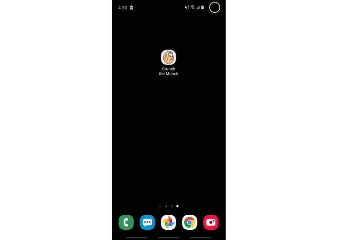

# MunchTheCrunch

https://devpost.com/software/crunch-the-munch

Inspiration
Each of the apps - Grubhub, Doordash, etc. - have their own algorithms to calculate delivery prices that vary through the day. I was tired of checking one after the other to find the best price I could get for the same food, so we decided to take action...

<h1>What it does</h1>
The app uses a hypothetical database of past transactions that log the delivery address, restaurant address, time of day, delivery company, and delivery cost for numerous queries. Based on user input for restaurant and delivery address, we search our database for similar orders in the same time of day to see which delivery company provides the cheapest option. The app outputs an estimated price and a link to the website from which the user can make their purchase.

How I Built it
We used Android Studio and Java (through the IDE IntelliJ). We began by looking up online tutorials for creating an app in Android Studio. There was a steep learning cuve, as none of us had much prior experience with app development. After long nights and alot of troubleshooting, we managed to put together our user interface with the search bars and incorporated Google APIs.

Challenges we ran into
-We originally wanted to use NCR's transaction API in order to track delivery logistics, but were unable to create and get the logs in the desired format. In addition, we had trouble manipulating the transaction logs and their data through our application (which was written in Java, while the NCR API used cURL) -We also gave up on using some other software for our database (i.e. Azure, web-based text files, Firebase), largely because of our inexperience with implementation -We used a lot of imports that we were unfamiliar with, so getting rid of compilation/runtime errors took a while -Google Calendar API time was incorrect and their Maps API wouldn't render in our original app:/

Accomplishments that we're proud of
-Our amazing icon (dedicated to our friend Albert who had an allergic reaction to a walnut during HackGSU) -The app interface is compatible with different phone sizes and supports landscape mode -It runs quickly and we haven't run into any major bugs -The name is catchy -We managed to implement the search and Google Maps nicely -The application feels like something we (and hopefully others!) could actually use in the future -It works:)

What we learned
-How important it is for programming languages to be consistent with one another -Many different and very useful Java/Android functions we weren't aware of -How to effectively use StackOverflow and other online resources -How to better judge the feasibility of a project

What's next for Crunch the Munch
-We plan to design a web scraper that could create a much larger database, which we would reorganize into a more efficient format based on location -We also hope to create a menu option with which users can see different price/delivery time estimates

